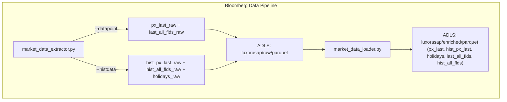
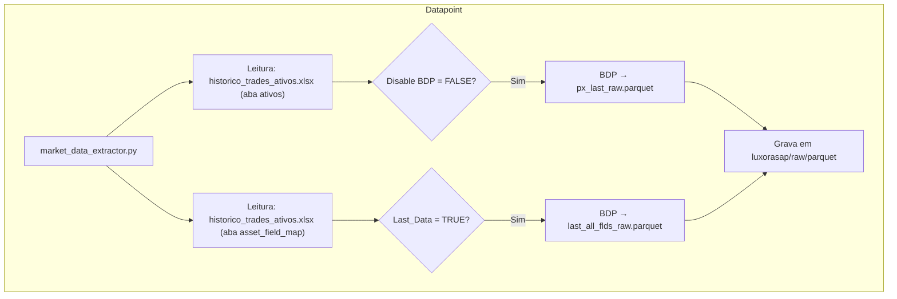
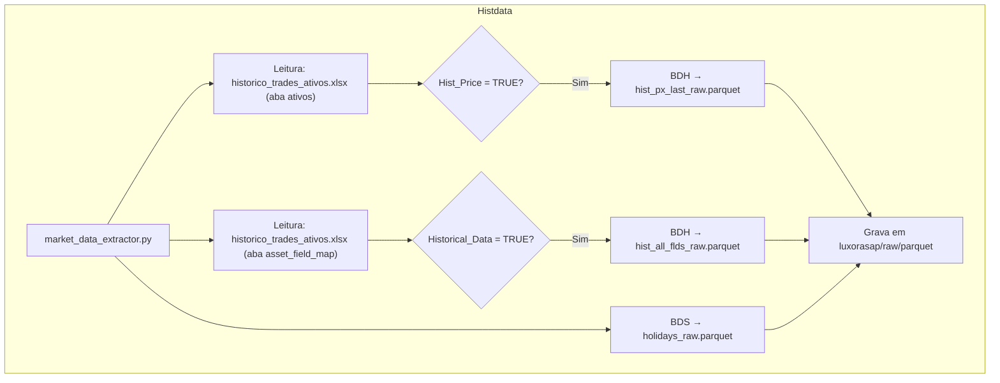
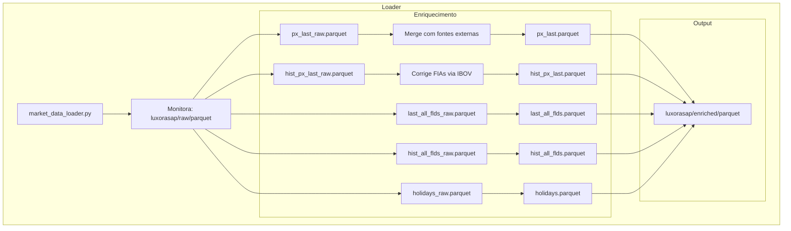

# Bloomberg Data Pipeline

Este documento descreve a arquitetura e o funcionamento do pipeline de extração de dados da Bloomberg utilizado no LuxorASAP. Ele cobre desde a extração via `blpAPI`, passando pelo armazenamento em `ADLS`, até a transformação e integração das tabelas finais.

---

## Visão Geral

---

## Etapa 1 – Extração via `market_data_extractor.py`

O script `market_data_extractor.py` é o ponto inicial do pipeline, responsável por consultar dados da Bloomberg via `blpAPI` e salvar arquivos `.parquet` no ADLS em `luxorasap/raw/parquet`.

### Modos de Execução

#### 1. `--datapoint`: Extração contínua (BDP)

Este modo do `market_data_extractor.py` realiza chamadas contínuas à API BDP da Bloomberg para extrair os **últimos preços** (`px_last_raw`) e **outros campos configurados** (`last_all_flds_raw`).  
A frequência da extração (day, hour, minute) e os ativos consultados são definidos nas abas `ativos` e `asset_field_map` do Excel `historico_trades_ativos.xlsx`.  
O script também contabiliza os **hits** consumidos (máximo de 500 mil por dia).

#### 2. `--histdata`: Extração histórica (BDH + BDS)

Este modo executa **consultas únicas** para baixar **preços históricos** (`hist_px_last_raw`), **campos históricos** (`hist_all_flds_raw`) e **feriados de mercado** (`holidays_raw`).  
As configurações são feitas no mesmo Excel, nas colunas `Hist_Price`, `Historical_Data` e `Start_Date`.  
Esse modo não é contínuo e não possui limitação explícita de uso por parte da Bloomberg.

### Resumo

| Modo          | Função BBG        | Tabelas de Saída                                        | Fonte de Frequência                     | Observações                                                              |
| ------------- | ----------------- | ------------------------------------------------------- | --------------------------------------- | ------------------------------------------------------------------------ |
| `--datapoint` | **BDP**           | `px_last_raw`, `last_all_flds_raw`                      | aba **ativos** e **asset\_field\_map**  | Consulta contínua (day/hour/minute). Monitora limite de 500 k *hits*/dia |
| `--histdata`  | **BDH** & **BDS** | `hist_px_last_raw`, `hist_all_flds_raw`, `holidays_raw` | abas **ativos** e **asset\_field\_map** | Execução pontual (batch). Sem limite explícito  

## Etapa 2 – Integração via `market_data_loader.py`

Após a extração, o script `market_data_loader.py` observa alterações nas pastas `raw/parquet` e inicia a transformação e integração dos dados.

Ao identificar novos arquivos, ele integra os dados da Bloomberg com outras fontes de preço internas, **corrige preços dos FIAs** com base no IBOV  
e gera as tabelas finais enriquecidas (`px_last`, `hist_px_last`, `holidays`, `last_all_flds`, `hist_all_flds`) na pasta `luxorasap/enriched/parquet`.

### Fontes integradas em `px_last.parquet`:

- `px_last_raw` (Bloomberg via BDP)
- `hist_non_bbg_px_last`
- `custom_prices`
- `custom_funds_quotas`
- `all_funds_quotas`
- `hist_vc_px_last`

### Transformações adicionais:

- **FIAs**: os preços em `hist_px_last_raw` são corrigidos até o dia atual com base no IBOV.

### Tabelas finais geradas em `luxorasap/enriched/parquet`:

- `px_last.parquet`: últimos preços de todos os ativos.
- `hist_px_last.parquet`: históricos ajustados (com correções).
- `holidays.parquet`: feriados integrados.
- `last_all_flds.parquet`: campos atuais de ativos.
- `hist_all_flds.parquet`: campos históricos de ativos.

---

## Conclusão

Este pipeline garante a extração estruturada e robusta dos dados da Bloomberg, respeitando as limitações da API e unificando múltiplas fontes de preço em uma camada final confiável. O processo está preparado para rodar de forma contínua e automática, assegurando que os dados estejam sempre atualizados para alimentar modelos, dashboards e análises internas da Luxor.

---
