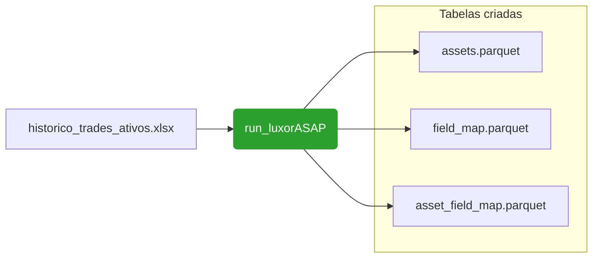
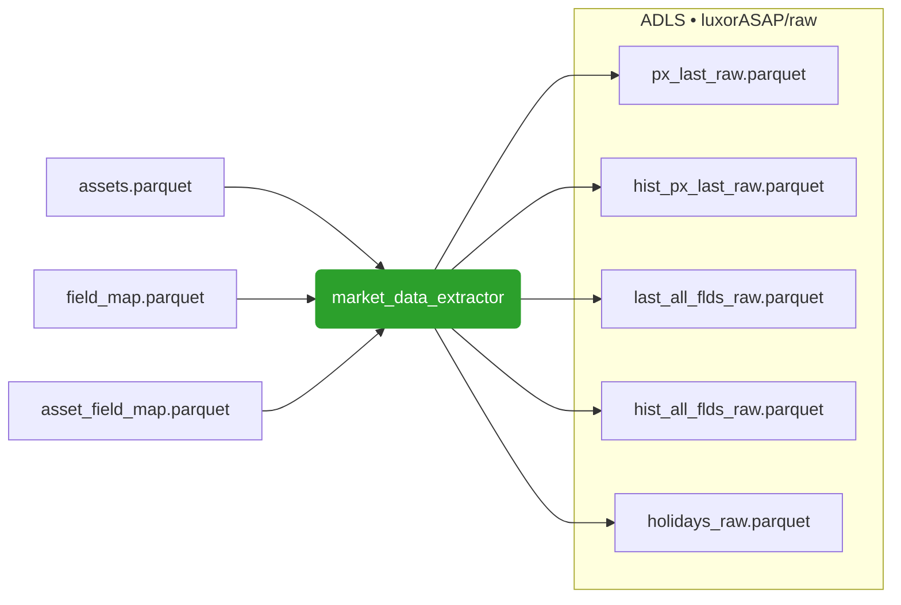
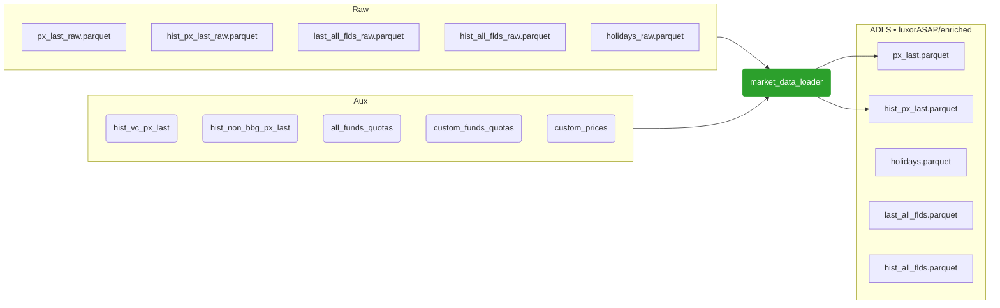

# Bloomberg → LuxorDB (Visão de alto nível)

```mermaid
flowchart LR
    H[historico_trades_ativos.xlsx] --> RL(run_luxorASAP)
    subgraph Metadata["Tabelas criadas"]
        A[assets.parquet]
        F[field_map.parquet]
        AF[asset_field_map.parquet]
    end
    RL --> A & F & AF

    classDef module fill:#2ca02c,color:#fff,stroke:#2ca02c;
    class RL module;
```

---

## 2 │ Extração Bloomberg → camada **raw**

```mermaid
flowchart LR
    %% entrada
    A[assets.parquet] & F[field_map.parquet] & AF[asset_field_map.parquet] --> MDE(market_data_extractor)

    %% saída
    subgraph Raw["ADLS • luxorASAP/raw"]
        PL[px_last_raw.parquet]
        HPL[hist_px_last_raw.parquet]
        LAF[last_all_flds_raw.parquet]
        HAF[hist_all_flds_raw.parquet]
        HOL[holidays_raw.parquet]
    end
    MDE --> PL & HPL & LAF & HAF & HOL

    classDef module fill:#2ca02c,color:#fff,stroke:#2ca02c;
    class MDE module;
```

---

## 3 │ Loader → camada **enriched** + ajuste de FIAs

```mermaid
flowchart LR
    %% arquivos observados
    subgraph Raw
        PL[px_last_raw.parquet]
        HPL[hist_px_last_raw.parquet]
        LAF[last_all_flds_raw.parquet]
        HAF[hist_all_flds_raw.parquet]
        HOL[holidays_raw.parquet]
    end

    %% tabelas auxiliares
    subgraph Aux
        HVC(hist_vc_px_last)
        HNB(hist_non_bbg_px_last)
        AFQ(all_funds_quotas)
        CFQ(custom_funds_quotas)
        CP(custom_prices)
    end

    Raw & Aux --> MDL(market_data_loader)

    %% enriched
    subgraph Enriched["ADLS • luxorASAP/enriched"]
        PLE[px_last.parquet]
        HPLE[hist_px_last.parquet]
        HE[holidays.parquet]
        LAFE[last_all_flds.parquet]
        HAFE[hist_all_flds.parquet]
    end
    MDL --> PLE & HPLE

    classDef module fill:#2ca02c,color:#fff,stroke:#2ca02c;
    class MDL module;
    class LDR module;
```