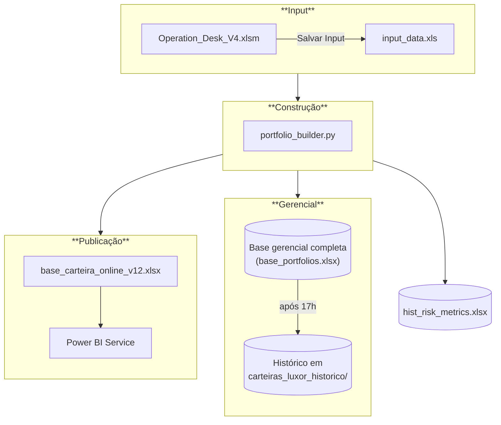
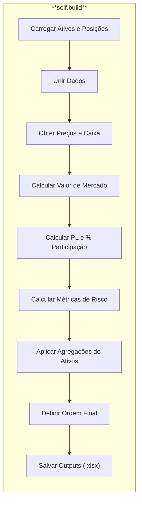

# Arquitetura: Pipeline da Carteira Online

Esta página descreve em detalhes o pipeline responsável pela construção e publicação da Carteira Online, cujo script principal é o `portfolio_builder.py`.

---

## 1. Visão Geral do Pipeline

---

## 2. Input de Dados

- **Arquivo Principal**: `carteira_online/production/bases_input/input_data.xls`
- **Origem**: É uma cópia da planilha `Operation_Desk_V4.xlsm`.
- **Geração**: O arquivo `input_data.xls` é gerado quando o usuário clica no botão "salvar_input" na `Operation_Desk_V4.xlsm`.

---

## 3. Configuração de Cores e Ordenação

A aparência do relatório é definida no início do script `portfolio_builder.py`, com base no campo **"Grupo"** cadastrado na aba 'ativos' da `Operation_Desk`.

### 3.1. Mapeamento de Cores
- **Cores Disponíveis**: As cores são definidas em `self.colors` (e.g., `{"nome_cor": "#HEXCODE"}`).
- **Dicionário**: `self.color_map` associa cada "Grupo" a uma cor pré-definida (e.g., `"azul_escuro"`, `"verde"`).
- **Exceção**: Posições com valor de mercado negativo são **sempre vermelhas**, independentemente do grupo mapeado.

### 3.2. Mapeamento de Ordem
- **Dicionário**: `self.order_modifiers` atribui um valor numérico a cada "Grupo" para definir a prioridade de exibição.
- **Lógica**: A ordem final de um ativo é `modificador_do_grupo + valor_de_mercado`.
  - O modificador deve ser sempre negativo e ter 9 zeros à direita. Modificadores menores aparecem mais acima.
  - Dentro de um mesmo grupo, ativos com maior valor de mercado aparecem primeiro.

---

## 4. Processo de Construção (Método `self.build`)

O método `self.build` orquestra a criação da carteira em uma sequência de passos:

1.  **Carregar Ativos e Posições**: Lê as abas de `input_data.xls`. 
2.  **Obter Preços e Caixa**:
   -   **Preços**: Utiliza o `luxorDB_datareader` para buscar os preços dos ativos.
   -   **Caixa**: Utiliza o `cash_calculator` para obter o caixa (onshore do BTG e offshore da `Operation_Desk`), somando os Trades RV.
3.  **Calcular Valor de Mercado**: Multiplica a quantidade pelo preço de cada ativo.
4.  **Calcular PL e Participação**: Calcula o Patrimônio Líquido de cada fundo e o percentual que cada ativo representa.
5.  **Exportar `base_portfolios.xlsx`**: Salva uma versão sem agregações em `carteira_online/production/bases_output/`. Após as 17h, uma cópia é arquivada em `carteira_online/production/carteiras_luxor_historico/`.
6.  **Calcular Métricas**: Processa métricas de risco e concentração.
7.  **Agregar Ativos**:
   -   Agrupa ilíquidos em "iliquids bz" e "iliquids us", mantendo abertos apenas gestores/empresas que representam de 1% do portfólio.
   -   Agrega ativos com o mesmo `Asset` (ex: `micrsoft_msft us equity` e `microsoft_msft34 bz equity`).
8.  **Salvar Outputs Finais**:
   -   `carteira_online/base_carteira_online_v12.xlsx`
   -   `carteira_online/production/metricas_risco/hist_risk_metrics.xlsx`

---

## 5. Agendamento e Publicação

### Agendamento do Script
- **Ambiente**: Máquina Virtual.
- **Frequência**: O script `portfolio_builder.py` é executado a cada 10 minutos no agendador do windows, nos minutos terminados em "7" (ex: 11:07, 11:17, 11:27...).

### Publicação no Power BI
- **Arquivo Fonte**: `projetos/dashboards/Carteira_Online_v1.25.pbix` (localizado no OneDrive).
- **Workspace**: "Luxor Investimentos" no Power BI Service.
- **Atualização**: O modelo semântico é atualizado via Power Automate a cada 10 minutos, das 11:00 às 17:50.