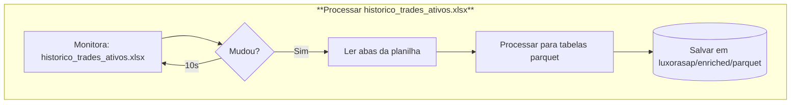
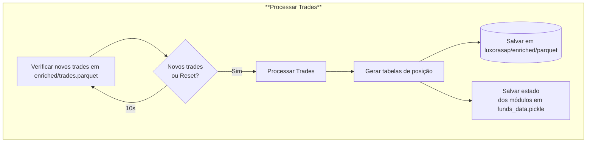

# Pipeline run_luxorASAP

Este documento detalha o funcionamento do script `run_luxorASAP.py`, que atua como o orquestrador, garantindo a propagação de input de dados dos ativos, trades e o recálculo contínuo das posições dos fundos.

## Visão Geral

O `run_luxorASAP.py` opera em um loop contínuo ao longo do dia, monitorando alterações em arquivos-chave e processando dados para manter as informações financeiras atualizadas. Ele é responsável por:

1.  **Monitorar e processar a planilha `historico_trades_ativos.xlsx`**: Propaga as entradas desta planilha para tabelas `.parquet` no data lake.
2.  **Processar trades e recalcular posições**: Garante que as posições dos fundos estejam sempre atualizadas com base nos trades registrados.

## Fluxo de Operação

## Detalhes do Processamento

### 1. Monitoramento e Atualização da Planilha-Mestra

Através de uma instância do `luxorDB_dataloader`, o script verifica continuamente se o horário da última modificação da planilha `source_bases/historico_trades_ativos.xlsx` foi alterado.

-   **Se houver alteração**:
    -   As abas da planilha são lidas, processadas e salvas como arquivos `.parquet` na pasta `luxorasap/enriched/parquet`.
    -   `boletas` se transforma em `trades.parquet`.
    -   `ativos` se transforma em `assets.parquet`.
    -   `VCs_prices` se transforma em `hist_vc_px_last.parquet`.
    -   `asset_field_map` se transforma em `asset_field_map.parquet`.
    -   `field_map` se transforma em `field_map.parquet`.

### 2. Processamento de Trades e Posições

A cada 10 segundos, o script verifica a existência de novos trades na tabela `enriched/trades.parquet`.

-   **Primeira execução do dia**: O script roda no **modo reset**, reprocessando todas as transações da tabela `trades` e gerando todas as tabelas de posição do zero.
-   **Novos trades ou alterações**: Se novos trades forem identificados ou se houver alterações em trades já processados (data, quantidade ou preço da boleta), o processamento é acionado.
-   **Tabelas de saída**: As seguintes tabelas são geradas ou atualizadas na pasta `luxorasap/enriched/parquet`:
    -   `last_positions.parquet`
    -   `hist_positions.parquet`
    -   `cash_movements.parquet`
    -   `hist_positions_by_bank.parquet`
    -   `last_positions_by_bank.parquet`

### 3. Detecção de Alterações e Modo Reset

O script também faz uma checagem dos trades já processados. Se for detectada qualquer alteração na **data**, **quantidade** ou **preço** de uma boleta existente, a flag de `reset` é ativada para a próxima execução. Isso garante que todos os trades sejam reprocessados, assegurando a consistência dos dados.

### 4. Módulos Auxiliares para Processamento de Trades

Para o processamento dos trades, o `run_luxorASAP.py` utiliza os seguintes módulos auxiliares:

-   **`fund.py`**: Fornece a estrutura para definir as contas bancárias (`bank_accounts`) e os ativos (`assets`) que cada fundo possui, além de gerenciar os trades que o fundo precisa processar.
-   **`asset.py`**: Executa o processamento individual de cada trade, controlando os trades de cada ativo e quais já foram processados.
-   **`bank_account.py`**: Possui a estrutura para organizar todos os ativos que estão associados a uma conta bancária específica. É responsável por processar os trades na visão dessa conta bancária (gerando as tabelas `*_by_bank`) e contém a lógica para processar boletas de transferência de ativos, aquela cujo `op_type` é "transf ativos".

### 5. Persistência das posições
Ao final de cada execução, o `run_luxorASAP` armazena os dados internos desses submódulos (`fund.py`, `asset.py`, `bank_account.py`) em um arquivo `.pickle` salvo em `LuxorASAP/funds_data`. Isso permite que o script retome seu estado ao ser religado. No entanto, a flag --reset está sendo usada por padrão. É possível alterar a main do script para permiter essa retomada de estado sem reprocessar tudo.