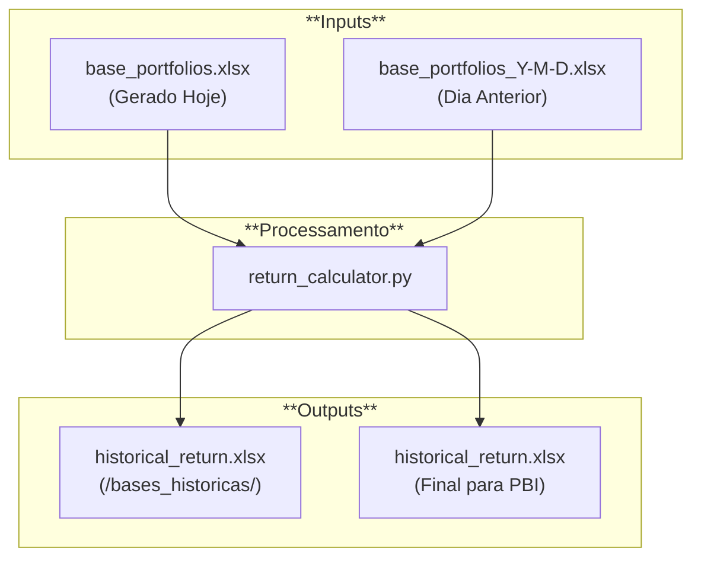
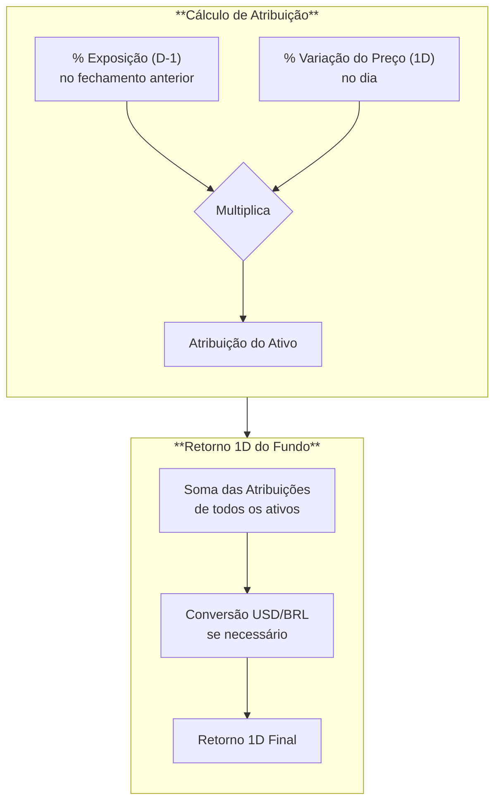
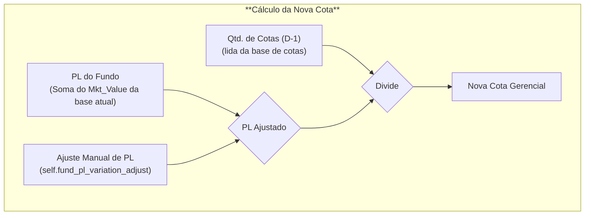

# Arquitetura: Pipeline do Relatório de Retornos

Este documento detalha o funcionamento do script `return_calculator.py`, que atua calculando a cota gerencial diária, além dos retornos 1D, MTD e YTD dos portfólios para atualização do relatório de retornos diários no Power BI.

---

## 1. Visão Geral do Pipeline

O script orquestra a leitura das bases gerenciais, o cálculo de cotas e retornos, e a geração dos outputs que alimentam o Power BI.

---

## 2. Entradas e Configuração

### 2.1. Arquivos de Input
- **Base do Dia Atual**: `carteira_online/production/bases_output/base_portfolios.xlsx`.
- **Base do Dia Anterior**: O arquivo mais recente em `carteira_online/production/carteiras_luxor_historico/bases_completas/`.

### 2.2. Configuração Interna
No início do script, duas variáveis principais definem o escopo do cálculo:

- `self.fund_names`: Lista os fundos para os quais a cota e o retorno serão calculados.
- `self.benchmark_names`: Mapeia os tickers de benchmarks e outros ativos (TCI, IP Atlas, Luxor Stocks, etc.) para os nomes que aparecerão no relatório final.

---

## 3. Lógica de Cálculo

### 3.1. Retorno Diário (1D) - Atribuição de Performance

O retorno diário de cada fundo é calculado pelo método `calculate_perf_attr`, que utiliza a **atribuição de performance** de cada ativo.

- A lógica multiplica a **exposição percentual (`%_pl`)** de cada ativo no fechamento anterior pela **variação de preço** do ativo no dia.
- A variação de preço é obtida via `luxorDB_datareader`.
- A soma das atribuições de todos os ativos resulta no retorno 1D do fundo na sua moeda local.
- O `calculate_returns` então converte esse valor para BRL e USD, usando a variação diária do `usdbrl`.

### 3.2. Cota Gerencial

A nova cota de cada fundo é calculada pelo método `calculate_quota`.

- **PL (Patrimônio Líquido)**: É a soma do `Mkt_Value` de todos os ativos na `base_portfolios.xlsx` do dia.
- **Ajuste Manual de PL**: A variável `self.fund_pl_variation_adjust` permite extornar valores de aportes/resgates que já impactaram o caixa, mas cuja quantidade de cotas ainda não foi atualizada na base oficial.
- **Quantidade de Cotas**: O script busca a última quantidade de cotas registrada para o fundo na sua respectiva base histórica.
- **Cálculo Final**: `PL Ajustado / Quantidade de Cotas (D-1)`.

> **Ajuste por Amortização**: O cálculo da cota utiliza o método `LuxorQuery.get_quota_adjusted_by_amortization`, que já retorna o valor da cota histórica corrigido por eventos de amortização (ex: Maratona). Os fatores e datas de amortização estão definidas diretamente no método do `LuxorQuery`.

### 3.3. Retornos MTD e YTD

O método `calculate_returns` consolida os cálculos:

- **Retorno 1D**: Utiliza a atribuição de performance já calculada.
- **Retorno MTD e YTD**: Utiliza a **nova cota gerencial** e a divide pela cota de referência (final do mês anterior e final do ano anterior, respectivamente), obtidas via `luxorDB_datareader`.

### 3.4. Benchmarks

Após o cálculo dos fundos, o método `calculate_benchmarks` itera sobre os atvios de `self.benchmark_names` e calcula os mesmos retornos (1D, MTD, YTD) para cada um, usando o `luxorDB_datareader`.

---

## 4. Outputs

### 4.1. Ordenação do Relatório

O método `save_hist_return` define a ordem de exibição dos fundos e benchmarks no relatório. A ordenação é controlada por dois dicionários que mapeiam cada fundo/benchmark a um valor numérico, um para a visão em USD e outro para BRL.

### 4.2. Exportando as bases

O script gera e atualiza o arquivo `historical_return.xlsx` em dois locais:

1.  **Base gerencial de retornos**: `carteira_online/production/bases_historicas/historical_return.xlsx`
2.  **Base para o Power BI**: `carteira_online/historical_return.xlsx`
> As bases são iguais. A diferença é que um é a base final que vai para o relatório de retornos e o outro é uma base editável, que será usada para inputar novas quantidades de cotas gerenciais quando houverem aportes/resgates.

---