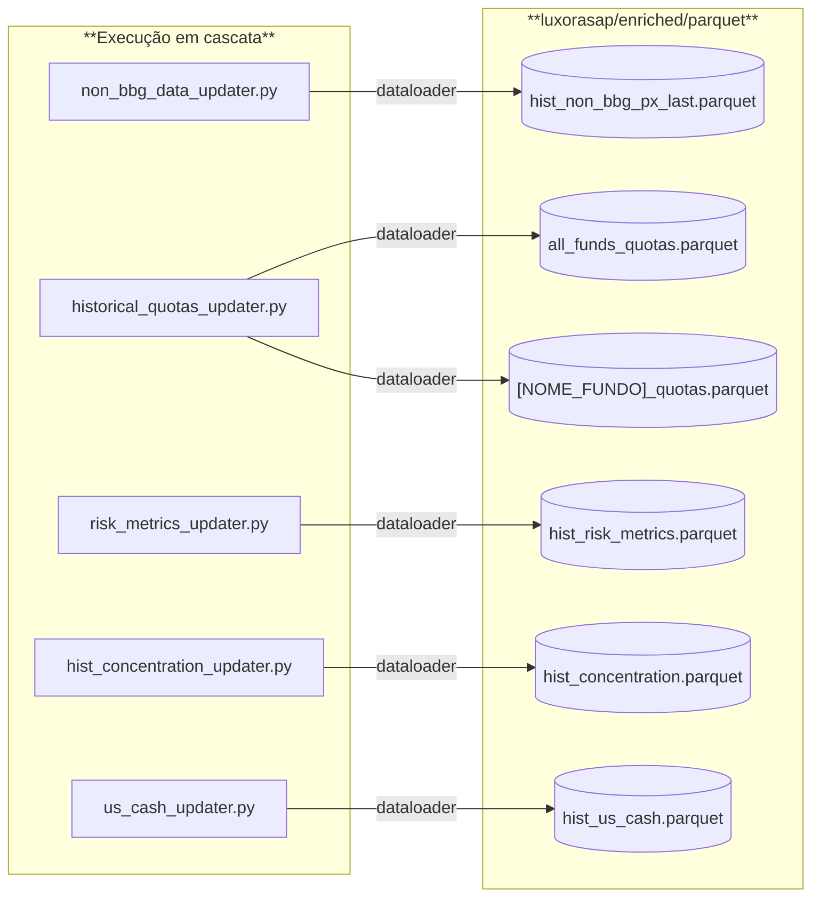
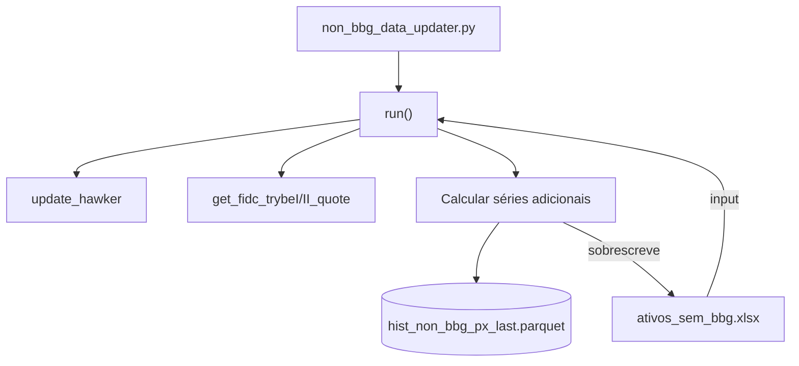
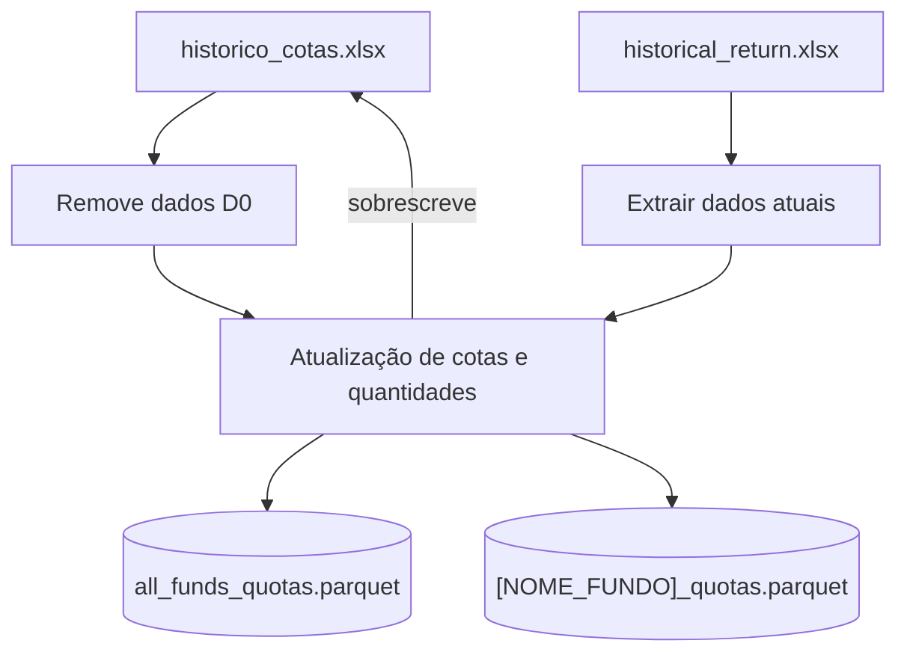
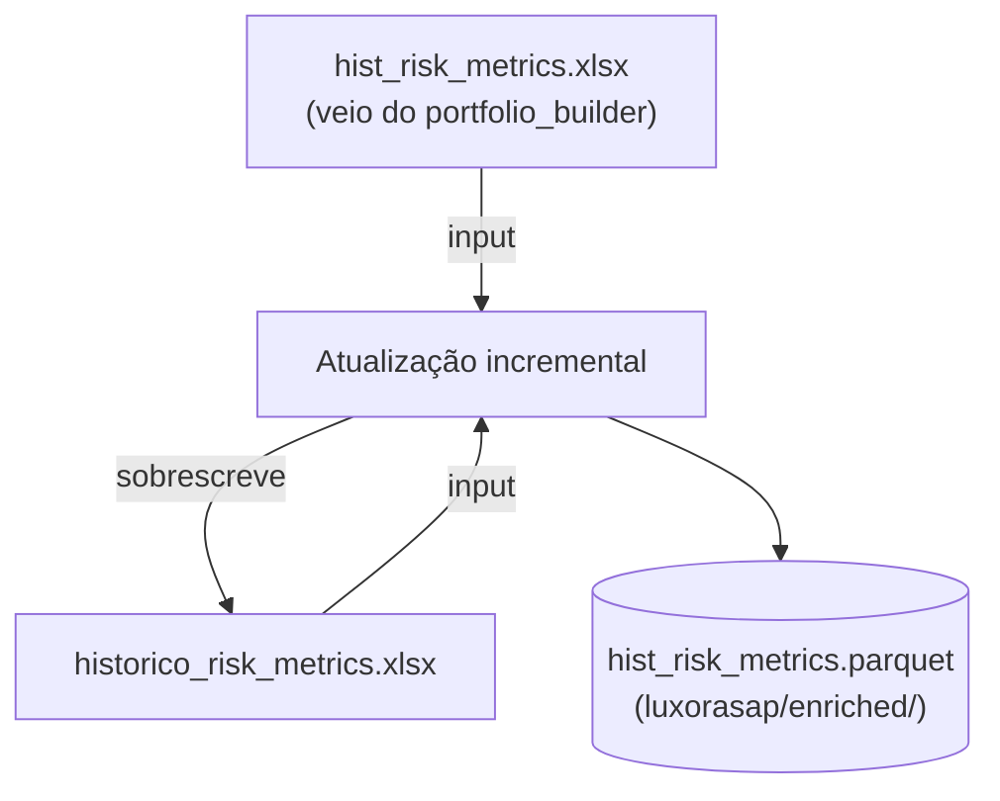
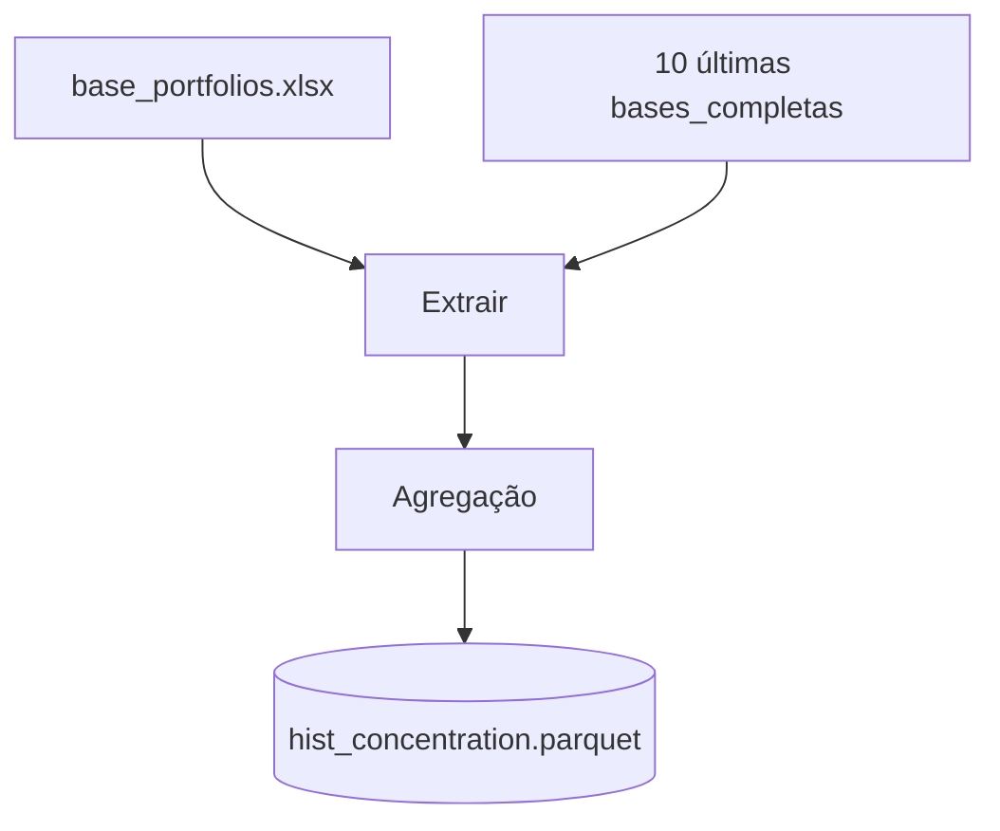
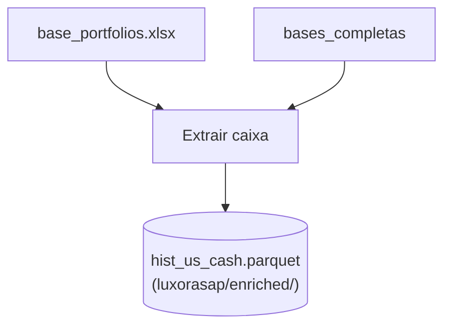

# Arquitetura: Pipeline `source_bases`

Este documento detalha o pipeline executado pelo script `source_bases_updater.py`, que atua como orquestrador para a atualização de diversas bases de dados auxiliares utilizadas pelo LuxorASAP.

---

## 1. Visão Geral do Pipeline

O `source_bases_updater.py` executa uma série de scripts especializados, cada um responsável por gerar ou atualizar um conjunto específico de dados em formato `.parquet` no ADLS, no diretório `luxorasap/enriched/parquet`. Embora sejam independentes, os scripts são executados sequencialmente.

<div align="center">

</div>

---

## 2. non_bbg_data_updater.py

Fluxo de execução:

<div align="center">

</div>
---


O script `non_bbg_data_updater.py` concentra diversos métodos para criação de séries históricas de dados não-Bloomberg. Entre esses:

- Cálculo de séries IPCA+, CPI+, loans (fixos e variáveis).
- Método `update_hawker`: estimativa diária de cotas das séries SPX Hawker durante o mês corrente.
- Métodos `get_fidc_trybeI_quote` e `get_fidc_trybeII_quote`: atualização de cotas dos FIDCs a partir do arquivo `carteiras_btg.xlsx` mais recente.
- Chamada `run()` central coordena tudo.


## 3. historical_quotas_updater.py

Fluxo de execução:

<div align="center">

</div>


O script `historical_quotas_updater.py` é responsável por atualizar as cotas históricas de todos os fundos Luxor. Ele realiza os seguintes passos:

1. Carrega a planilha `historico_cotas.xlsx` até o dia anterior.
2. Carrega a planilha `carteira_online/production/bases_historicas/historical_return.xlsx` gerada pelo `return_calculator.py`.
3. Remove a última data existente em `historico_cotas.xlsx`.
4. Atualiza `historico_cotas.xlsx` com as cotas e quantidades mais recentes provenientes dos `historical_returns`.
5. Para fundos não presentes em `historical_returns`, propaga cota e quantidade do dia anterior.
6. Salva (sobrescreve) `historico_cotas.xlsx`.
7. Gera e salva no ADLS:
    - `all_funds_quotas.parquet`
    - `[NOME_FUNDO]_quotas.parquet` para cada fundo.


---

## 4. risk\_metrics\_updater.py

Fluxo de execução:
<div align="center">


</div>
---

O script `risk_metrics_updater.py` simplesmente recebe como input esta planilha:

```
carteira_online/production/carteiras_luxor_historico/metricas_risco/hist_risk_metrics.xlsx
```

Essa planilha possui as métricas mais atualizadas vindas da última execução do `portfolio_builder.py`. Em seguida, realiza:

- Atualização incremental da base `source_bases/historico_risk_metrics.xlsx`.
- Sobrescreve a base `source_bases/historico_risk_metrics.xlsx`.
- Salva no ADLS `hist_risk_metrics.parquet`.


## 5. hist\_concentration\_updater.py

Fluxo de execução:
<div align="center">

</div>

Este script atualiza a base `hist_concentration.parquet` a partir da **`base_portfolios.xlsx`** e dos **10** arquivos mais recentes em `bases_completas/`.
> 🛈 **Uso atual baixo** – Este fluxo está sendo pouco usado, vale avaliar se pode ser descontinuado.
---


## 6. us_cash_updater.py

Fluxo de execução:

<div align="center">

</div>

O script `us_cash_updater.py` atualiza o histórico de caixa dos fundos A, B e HMX em:

```
luxorasap/enriched/parquet/hist_us_cash.parquet
```

Fontes:

- Planilha `base_portfolios.xlsx` mais recente (gerada pelo `portfolio_builder.py`).
- Arquivos históricos em `carteiras_luxor_historico/bases_completas/`.

